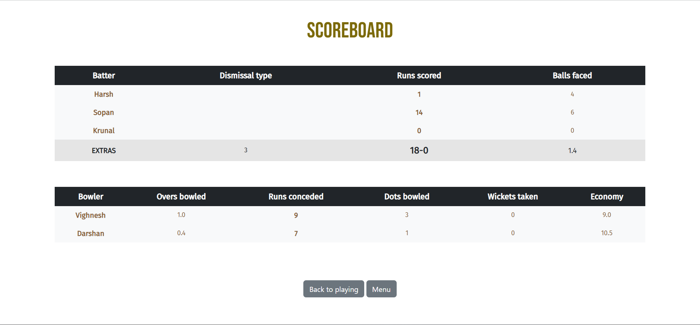
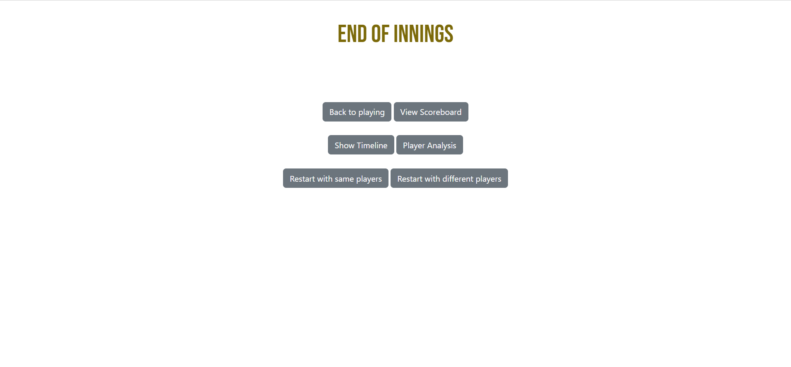
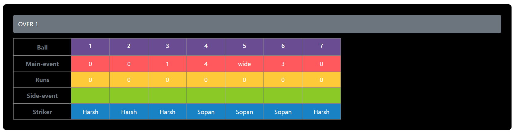
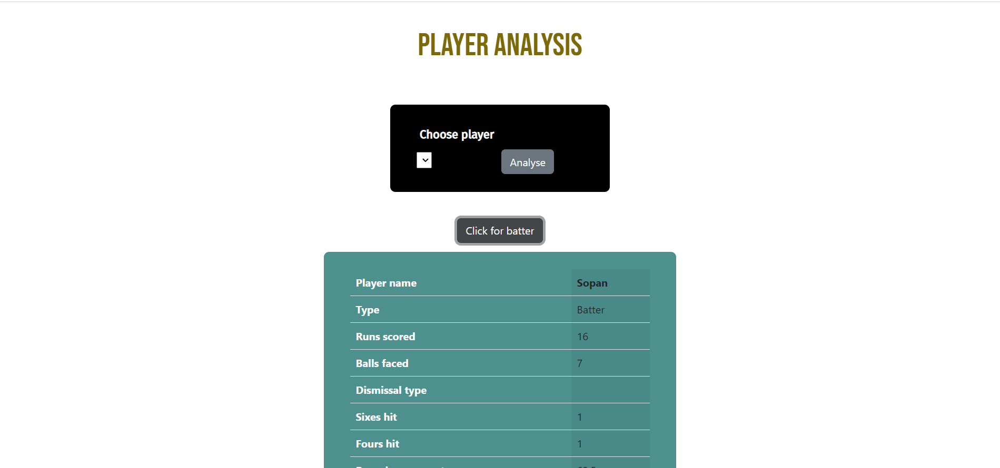

# CRICHENK
###### A Cricket single-innings analysis game

## About
This is a cricket analysis platform where the user provides data in the form of ball-happenings or ball-events for each ball bowled. Though user-friendly, a basic knowledge of Cricket is expected to play along.

## How To Play

### Input Players
After getting started, the user has to provide a list of players in the form of their names. Batters are to be entered in the order they bat. Bowlers should be entered in the manner they deliver the overs. Hence, repetition in bowlers list is permitted but not in batters list. Also, batters and bowlers should be distinct players. No batter can bowl and vice-versa which is pretty natural. Once the players lists are entered, no changes in any of the lists are allowed, unless the game is restarted.

### Provide ball-events
###### `events`                      = ['0', '1', '2', '3', '4', '5', '6', 'wide', 'legbye', 'bye', 'noball', 'bowled', 'lbw', 'caught', 'stumped', 'hitwicket', 'runout']
###### `runs_events`                 = ['0', '1', '2', '3', '4', '5', '6']
###### `extra_events`                = ['wide', 'legbye', 'bye', 'noball']
###### `wicket_events`               = ['bowled', 'lbw', 'caught', 'stumped', 'hitwicket']
`events` are all the events possible in the game, of which `runs_events`, `extra_events` and `wicket_events` are subsets.
In this segment, the user is required to provide ball-event(s) for each ball he/she wants to seek analysis of. A ball is divided into following fields:
* `main-event`
* `runs`
* `side-event`
* `end`
* `crossed-over`  

Out of these, the `main-event` and `runs` fields are mandatory for each ball. `side-event` is meant only if `main-event` is a subset of `extra_events`, for there could be additional events on these specific events. `end` and `crossed-over` are applicable only if `main-event` or `side-event` is `runout` which respectively mean the end at which throw was made (`Batting` or `Bowling`) and did the batters cross-over before the run-out was made (`Yes` or `No`).    

`main-event` may contain any value out of `events`.    

`runs` is applicable only if `main-event` is a subset of `extra_events` or that of `wicket_events` if it's a free-hit. It can contain the values `0`, `1`, `2`, `3`, `4`, `5` and `6` specifying runs scored in the current event. Note that the `runs` field is `0` if `main-event` is a subset of `runs_events` as runs scored on such an event is directly implied by the `main-event`.    

`side-event` contains the value `runout` if `main-event` is a subset of `extra_events` and also contains `stumped` if `main-event` is `wide`, although a default option `none` is selected implying no `sde-event` did actually happen.  
  
`end` and `crossed-over` too have their default values set to `na` (not applicable). Only if it's a run-out, that these fields really make sense.  
   
In this way the user is required to submit ball-event for each ball. 

### Interactive Summarizer

There's an interactive scoreboard summarizer at the top of the page. It shows striker (with a `*`), non-striker, current bowler and their individual scores alongwith current score. The message area in the summarizer announces warnings and special-events in the game. There is also a 'THIS OVER' area atop event-selection pane which shows current-over ball-events at a glance.

### View Scoreboard

The user can view the scoreboard any time by clicking on `View Scoreboard` button at the bottom of the page.

### Menu

The menu page can be toggled to through `Menu` button on edit-over and scoreboard pages. It provides a variety of buttons.

### Show Timeline

To summarise ball-by-ball happening of the game in the middle of it or once it is finished, the user can visit timeline page by clicking on `Show Timeline` button on menu page.

### Player Analysis

The button `Player Analysis` will take the user to analysis page where he/she is required to choose among the list of players provided in the beginning of the game. After selecting one of the players and clicking `Analyse`, the user has to click one of the collapse buttons, depending upon type of player (batter or bowler). The collapsed window shows chosen player analysis. To select some different player, click on `Choose another player` and perform same steps.

### Restart
On the menu page, the user is provided with two more choices: `Restart with same players` and `Restart with different players`. These button serve what they read; clicking on them restarts the game with same players (and same batting and bowling order) or restarts the game with new players that the user has to provide.  
